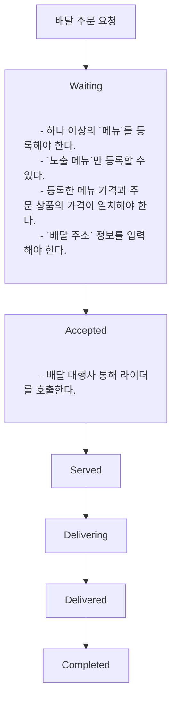
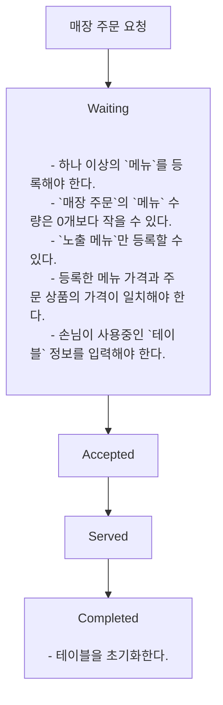
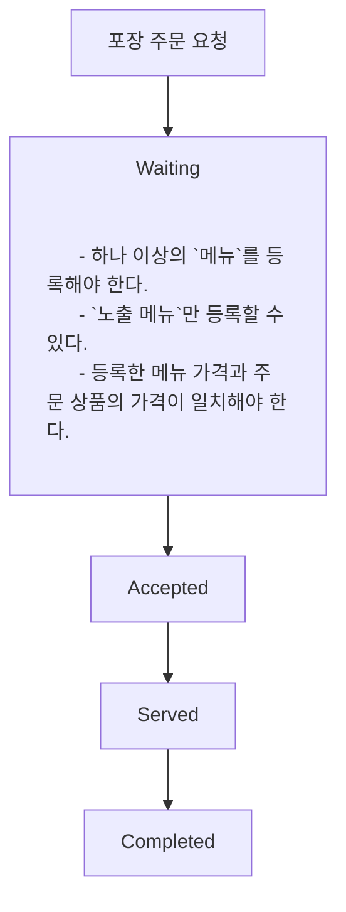

# 키친포스

## 퀵 스타트

```sh
cd docker
docker compose -p kitchenpos up -d
```

## 요구 사항

### 상품

- 상품을 등록할 수 있다.
- 상품의 가격이 올바르지 않으면 등록할 수 없다.
    - 상품의 가격은 0원 이상이어야 한다.
- 상품의 이름이 올바르지 않으면 등록할 수 없다.
    - 상품의 이름에는 비속어가 포함될 수 없다.
- 상품의 가격을 변경할 수 있다.
- 상품의 가격이 올바르지 않으면 변경할 수 없다.
    - 상품의 가격은 0원 이상이어야 한다.
- 상품의 가격이 변경될 때 메뉴의 가격이 메뉴에 속한 상품 금액의 합보다 크면 메뉴가 숨겨진다.
- 상품의 목록을 조회할 수 있다.

### 메뉴 그룹

- 메뉴 그룹을 등록할 수 있다.
- 메뉴 그룹의 이름이 올바르지 않으면 등록할 수 없다.
    - 메뉴 그룹의 이름은 비워 둘 수 없다.
- 메뉴 그룹의 목록을 조회할 수 있다.

### 메뉴

- 1 개 이상의 등록된 상품으로 메뉴를 등록할 수 있다.
- 상품이 없으면 등록할 수 없다.
- 메뉴에 속한 상품의 수량은 0 이상이어야 한다.
- 메뉴의 가격이 올바르지 않으면 등록할 수 없다.
    - 메뉴의 가격은 0원 이상이어야 한다.
- 메뉴에 속한 상품 금액의 합은 메뉴의 가격보다 크거나 같아야 한다.
- 메뉴는 특정 메뉴 그룹에 속해야 한다.
- 메뉴의 이름이 올바르지 않으면 등록할 수 없다.
    - 메뉴의 이름에는 비속어가 포함될 수 없다.
- 메뉴의 가격을 변경할 수 있다.
- 메뉴의 가격이 올바르지 않으면 변경할 수 없다.
    - 메뉴의 가격은 0원 이상이어야 한다.
- 메뉴에 속한 상품 금액의 합은 메뉴의 가격보다 크거나 같아야 한다.
- 메뉴를 노출할 수 있다.
- 메뉴의 가격이 메뉴에 속한 상품 금액의 합보다 높을 경우 메뉴를 노출할 수 없다.
- 메뉴를 숨길 수 있다.
- 메뉴의 목록을 조회할 수 있다.

### 주문 테이블

- 주문 테이블을 등록할 수 있다.
- 주문 테이블의 이름이 올바르지 않으면 등록할 수 없다.
    - 주문 테이블의 이름은 비워 둘 수 없다.
- 빈 테이블을 해지할 수 있다.
- 빈 테이블로 설정할 수 있다.
- 완료되지 않은 주문이 있는 주문 테이블은 빈 테이블로 설정할 수 없다.
- 방문한 손님 수를 변경할 수 있다.
- 방문한 손님 수가 올바르지 않으면 변경할 수 없다.
    - 방문한 손님 수는 0 이상이어야 한다.
- 빈 테이블은 방문한 손님 수를 변경할 수 없다.
- 주문 테이블의 목록을 조회할 수 있다.

### 주문

- 1개 이상의 등록된 메뉴로 배달 주문을 등록할 수 있다.
- 1개 이상의 등록된 메뉴로 포장 주문을 등록할 수 있다.
- 1개 이상의 등록된 메뉴로 매장 주문을 등록할 수 있다.
- 주문 유형이 올바르지 않으면 등록할 수 없다.
- 메뉴가 없으면 등록할 수 없다.
- 매장 주문은 주문 항목의 수량이 0 미만일 수 있다.
- 매장 주문을 제외한 주문의 경우 주문 항목의 수량은 0 이상이어야 한다.
- 배달 주소가 올바르지 않으면 배달 주문을 등록할 수 없다.
    - 배달 주소는 비워 둘 수 없다.
- 빈 테이블에는 매장 주문을 등록할 수 없다.
- 숨겨진 메뉴는 주문할 수 없다.
- 주문한 메뉴의 가격은 실제 메뉴 가격과 일치해야 한다.
- 주문을 접수한다.
- 접수 대기 중인 주문만 접수할 수 있다.
- 배달 주문을 접수되면 배달 대행사를 호출한다.
- 주문을 서빙한다.
- 접수된 주문만 서빙할 수 있다.
- 주문을 배달한다.
- 배달 주문만 배달할 수 있다.
- 서빙된 주문만 배달할 수 있다.
- 주문을 배달 완료한다.
- 배달 중인 주문만 배달 완료할 수 있다.
- 주문을 완료한다.
- 배달 주문의 경우 배달 완료된 주문만 완료할 수 있다.
- 포장 및 매장 주문의 경우 서빙된 주문만 완료할 수 있다.
- 주문 테이블의 모든 매장 주문이 완료되면 빈 테이블로 설정한다.
- 완료되지 않은 매장 주문이 있는 주문 테이블은 빈 테이블로 설정하지 않는다.
- 주문 목록을 조회할 수 있다.

## 용어 사전

### 공통
| 한글명 | 영문명       | 설명                               |
|-----|-----------|----------------------------------|
| 사장님 | Owner     | 매장에서 포스기를 사용하여 주문을 처리하는 사람       |
| 손님  | Guest     | 매장으로 주문을 넣는 사람                   |
| 비속어 | Profanity | 불쾌감을 주는 단어로 상품과 메뉴 이름에 사용될 수 없다. |

### 상품
| 한글명   | 영문명           | 설명                                              |
|-------|---------------|-------------------------------------------------|
| 상품    | Product       | 매장에서 조리하여 판매가능한 음식 ex) 후라이드 치킨                  |
| 상품 가격 | Product Price | 상품 1개의 가격. 가격은 0원 이상이어야 하며 변경할 수 있다. ex) 10000원 |
| 상품 이름 | Product Name  | 상품을 구분하기 위한 이름. 비속어는 들어갈 수 없다.                  |

### 메뉴 그룹
| 한글명      | 영문명            | 설명                             |
|----------|----------------|--------------------------------|
| 메뉴 그룹    | MenuGroup      | 메뉴를 분류하는 카테고리 ex) 추천, 세트메뉴, 음료 |
| 메뉴 그룹 이름 | MenuGroup Name | 메뉴 그룹 이름으로 빈 문자열은 들어갈 수 없다.    |

### 메뉴
| 한글명      | 영문명          | 설명                                                              |
|----------|--------------|-----------------------------------------------------------------|
| 메뉴       | Menu         | 손님에게 판매되는 단위. 하나 이상의 음식(상품)으로 구성되며 하나의 메뉴 그룹에 속한다. ex) 후라이드 1+1 |
| 메뉴 상품    | Menu Product | 메뉴를 구성하는 상품이고 1개 이상의 수량 정보를 갖는다. ex) 후라이드 2개                    |
| 메뉴 가격    | Menu Price   | 손님에게 판매되는 가격. 가격은 메뉴 상품 금액의 합보다 낮아야하며 변경할 수 있다. ex) 19000원      |
| 메뉴 이름    | Menu Name    | 손님에게 노출되는 이름. 비속어는 들어갈 수 없다.                                    |
| 메뉴 노출 상태 | Displayed    | 메뉴를 손님에게 노출시킬지를 결정하는 상태                                         |
| 노출 메뉴    | Display Menu | 손님에게 노출되는 메뉴                                                    |
| 숨김 메뉴    | Hide Menu    | 손님에게 숨겨지는 메뉴                                                    |

### 주문
| 한글명   | 영문명             | 설명                                                                                  |
|-------|-----------------|-------------------------------------------------------------------------------------|
| 주문    | Order           | 손님에게 주문되는 단위. 하나 이상의 메뉴로 구성된다.                                                      |
| 주문 메뉴 | Order Line Item | 주문을 구성하는 메뉴이고 1개 이상의 수량을 갖는다. ex) `후라이드 1+1 2개`                                     |
| 주문 유형 | Order Type      | 손님이 주문하는 유형. ex) [배달 주문](#배달-주문), [매장 주문](#매장-주문), [포장 주문](#포장-주문)                  |
| 배달 주문 | Delivery Order  | 손님이 주소로 메뉴 배달을 요청하는 주문                                                              |
| 매장 주문 | EatIn Order     | 손님이 매장 테이블로 메뉴 서빙을 요청하는 주문                                                          |
| 포장 주문 | Takeout Order   | 손님이 메뉴 포장을 요청하는 주문                                                                  |
| 주문 상태 | Order Status    | 주문의 진행 현황을 나타내는 상태. ex) Waiting, Accepted, Served, Delivering, Delivered, Completed |
| 주문 시간 | Order Date Time | 주문이 생성된 시간                                                                          |

#### 배달 주문
| 한글명   | 영문명              | 설명                           |
|-------|------------------|------------------------------|
| 배달 주소 | Delivery Address | 배달 주문 손님에게 배달을 가야하는 목적지 주소   |
| 배달 요청 | Delivery Request | 주문 접수 후 배달 대행사 통해 라이더를 호출한다. |
| 대기중   | Waiting          | 배달 주문이 생성되고 접수를 기다리는 상태      |
| 접수됨   | Accepted         | 배달 요청 후 배달 주문이 접수된 상태        |
| 전달됨   | Served           | 음식을 라이더에게 전달한 상태             |
| 배달중   | Delivering       | 라이더가 음식을 손님에게 배달중인 상태        |
| 배달됨   | Delivered        | 라이더가 손님에게 음식을 배달완료한 상태       |
| 완료됨   | Completed        | 주문의 모든 과정이 완료된 상태            |
| 라이더   | Rider            | 배달 주문된 메뉴들을 배달 주소에 전달해줄 사람   |

#### 매장 주문
| 한글명 | 영문명       | 설명                                    |
|-----|-----------|---------------------------------------|
| 대기중 | Waiting   | 매장 주문이 생성되고 접수를 기다리는 상태               |
| 접수됨 | Accepted  | 매장 주문이 접수된 상태                         |
| 전달됨 | Served    | 테이블에 음식이 서빙된 상태                       |
| 완료됨 | Completed | 주문의 모든 과정이 완료된 상태로 주문이 완료되면 테이블을 비운다. |

#### 포장 주문
| 한글명 | 영문명       | 설명                      |
|-----|-----------|-------------------------|
| 대기중 | Waiting   | 포장 주문이 생성되고 접수를 기다리는 상태 |
| 접수됨 | Accepted  | 포장 주문이 접수된 상태           |
| 전달됨 | Served    | 손님에게 포장된 음식이 전달된 상태     |
| 완료됨 | Completed | 주문의 모든 과정이 완료된 상태       |

### 테이블
| 한글명      | 영문명              | 설명                                                  |
|----------|------------------|-----------------------------------------------------|
| 테이블      | Table            | 매장 주문이 가능한 테이블                                      |
| 테이블 이름   | Table Name       | 테이블을 구분하기 위한 이름. 빈 문자열은 들어갈 수 없다.                   |
| 테이블 상태   | Table Status     | 테이블이 주문을 받을 수 있는지 나타내는 상태.                          |
| 테이블 사용중  | Occupied         | 손님이 테이블을 사용할 수 없는 상태.                               |
| 테이블 비어있음 | Unoccupied       | 손님이 테이블을 사용할 수 있는 상태.                               |
| 인원 수     | Number Of Guests | 테이블에 앉은 손님 수. 0명 이상이어야 하며 사용중인 테이블의 인원 수를 변경할 수 있다. |

## 모델링

### 상품
- `상품`은 `상품 이름`과 `상품 가격`을 필수로 가진다.
- `사장님`은 `상품`을 등록할 수 있다.
  - `상품 이름`에 `비속어`를 사용할 수 없다.
  - `상품 가격`은 0원 이상이여야 한다.
  - 
- `사장님`은 `상품 가격`을 변경할 수 있다.
  - `상품 가격` 변경 시 `메뉴 상품` 가격의 합보다 `메뉴 가격`이 비싸면 메뉴가 `숨김 처리`된다.
  - 

### 메뉴 그룹
- `메뉴 그룹`은 `메뉴 그룹 이름`을 필수로 가진다.
- `사장님`은 `메뉴 그룹`을 등록할 수 있다.
  - `메뉴 그룹 이름`은 빈 문자열이 될 수 없다.

### 메뉴
- `메뉴`는 `메뉴 이름`, `메뉴 가격`, `메뉴 그룹`, `메뉴 상품`, `메뉴 노출 상태`을 필수로 가진다.
- `사장님`은 `메뉴`를 등록할 수 있다.
  - `메뉴 이름`에 `비속어`를 사용할 수 없다.
  - `메뉴 가격`은 0원 이상이어야 한다.
  - `메뉴 상품` 가격의 합보다 `메뉴 가격`이 비쌀 수 없다.
  - 하나의 `메뉴 그룹`을 설정해야 한다.
  - `메뉴 노출 상태`를 `노출` 혹은 `숨김` 상태로 설정할 수 있다.
  - 한 가지 이상의 `메뉴 상품`을 등록해야 한다.
  - `메뉴 상품`의 수량은 하나 이상이어야 한다.
  - 
- `사장님`은 `메뉴 가격`을 수정할 수 있다.
  - `메뉴 상품` 가격의 합보다 `메뉴 가격`이 비쌀 수 없다.
  - 
- `사장님`은 `메뉴 노출 상태`를 수정할 수 있다.
  - `노출 메뉴`로 변경할 수 있다.
    - `메뉴 상품` 가격의 합보다 `메뉴 가격`이 비싸면 `노출` 상태로 변경할 수 없다.
  - `숨김 메뉴`로 변경할 수 있다.
  - 

### 테이블
- `테이블`은 `테이블 이름`, `테이블 상태`, `인원 수`를 필수로 가진다.
- `사장님`은 `테이블`을 등록할 수 있다.
  - 
- `사장님`은 `테이블`의 `인원 수`를 변경할 수 있다.
  - 사용 중인 `테이블`의 `인원 수`만 변경할 수 있다.
  - `인원 수`는 0명 이상이어야 한다.
  - 
- `사장님`은 `테이블`을 초기화할 수 있다.
  - 매장주문이 완료되지 않은 테이블은 초기화 할 수 없다.
  - 

### 주문
- `주문`은 `주문 유형`, `주문 상태`, `주문 시간`, `주문 상품`을 필수로 가지고, `주문 유형`에 따라 `배달 주소`와 `테이블`을 가진다.

### 배달 주문
`사장님`은 포스기로 `배달 주문`을 진행시킬 수 있다.


### 매장 주문
`사장님`은 포스기로 `매장 주문`을 진행시킬 수 있다.


### 포장 주문
`사장님`은 포스기로 `포장 주문`을 진행시킬 수 있다.

